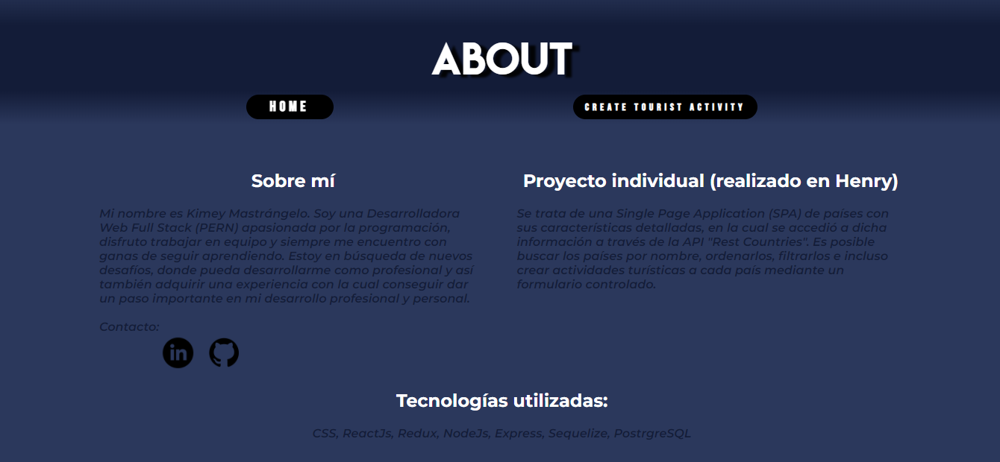

# *Countries App*

## Proyecto académico realizado en el Bootcamp Henry

### Realizado con:

- CSS
- ReactJs
- Redux
- Axios
- JavaScript
- NodeJs
- ExpressJs
- Promises
- Sequelize
- PostgreSQL

### Descripción
* Se trata de mi primer proyecto. Es una Single Page Application (SPA) de países con sus características detalladas, en la cual se accedió a dicha información a través de la API "Rest Countries".
* Es posible buscar los países por nombre, ordenarlos, filtrarlos e incluso crear actividades turísticas a cada país mediante un formulario controlado.

### Mirá mi proyecto [aquí].
[aquí]: https://youtu.be/EnA6AvkiJFE

## HOME

## DETALLE DEL PAÍS

## FORMULARIO DE CREACIÓN DE ACTIVIDAD TURÍSTICA

## ABOUT

